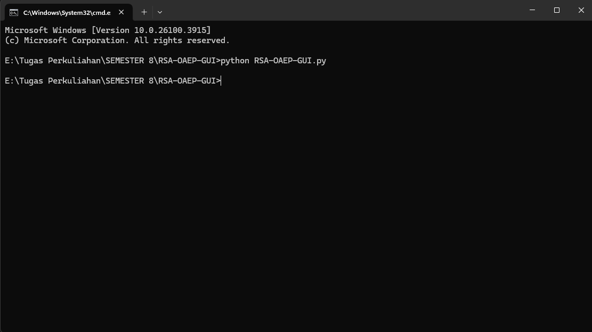
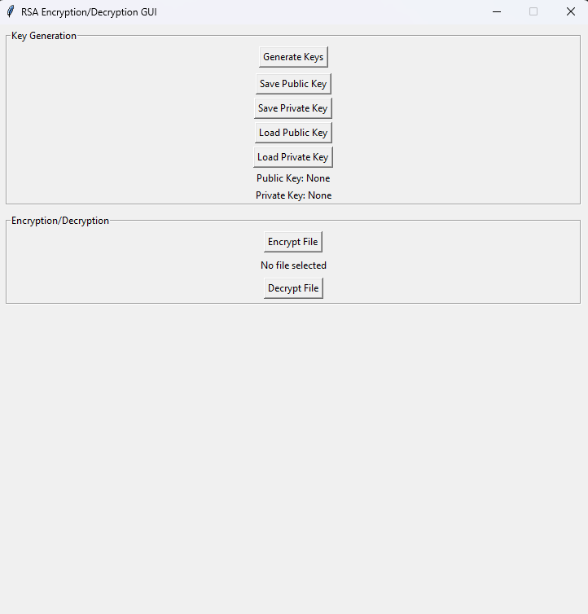
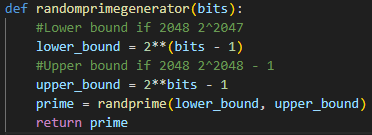
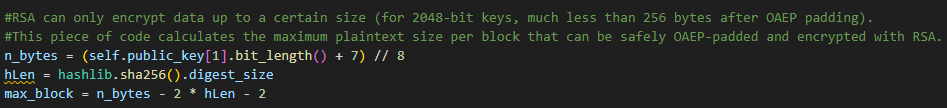
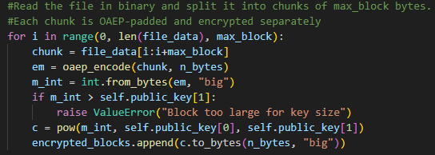
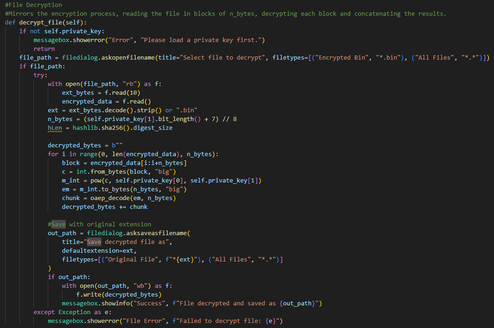

# Rationale and Documentation

## 1. How to use the program
### Open CMD and type out this command to open the program

### You will be greeted with this user interface

### To start encrypting and decrypting, press the generate key button at the very top
### After the key generation process is completed, press the save public key button to save the public key
### After saving the public key, press the save private key button to save the private key
### The public and private key is saved in a .pub .pri format for encryption and decryption use, also with .txt format for verification
### Encryption
    To encrypt a file, load the saved public key by pressing the load public key button
    Select the file you want to encrypt
    The program will prompt you to select where you want to save the file and the name
    Press save and you will have your encrypted file in binary format
### Decryption
    To decrypt a file, load the saved private key by pressing the load private key button
    Select the file you want to decrypt
    The program will prompt you to select where you want to save the decrypted file and the name
    Press save and you will have your decrypted file in it's original format

## 2. Rationale
### Prime generator

#### This program is meant to implement RSA 2048 bit OAEP mode, therefore the prime we need for the operations must have an upper bound of 2^2048 -1 and a lower bound of 2^2047

#### Explained in code

#### Explained in code

#### Explained in code